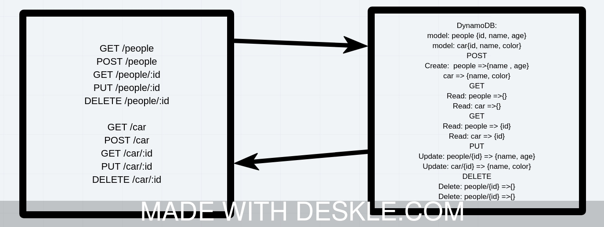

# LAB - Class 18

## Project: serverless-api

### Author: Omar Ramadan

### Links and Resources

- [Pull Request]
- [Root URL](https://47va41qh1l.execute-api.us-east-1.amazonaws.com/)

### Setup

This module acts as a lambda function operate on AWS Lambda functions and uses the DyanamoDB and API Gateway. You have to do the followinh:

1. Go to your AWS profile and login.
2. Go to Lambda service and create a new function.
3. Upload a zip file containing all the file needed to run the module including the node_moudles folder with all the packages installed.
4. Assign permission to the role which you can find in the Lambda function page: Lambda function > configuration > Execution Role > Attach Policy > DynamoDBFullAccess.
5. Go to API Gatewat. Create new HTTP API service.
6. Add the route `/path` with GET and POST methods. Add the route `/{path}/{id}` with GET, Delete and PUt methods.
7. For each method, click on attach integration, and add the lambda function integration to all the paths.
8. Using postman, you can test the API.

#### UML

#### Endpoints

- /{path}
- /{path}/{id}
- /people GET and POST
- /car GET and POST
- /people/:id  GET , Delete , PUT
- /car/:id  GET , Delete , PUT

##### Models

People: {name: String , age:Number}
car: {name:String , color:String}

##### Root URL

[root](https://47va41qh1l.execute-api.us-east-1.amazonaws.com/)
